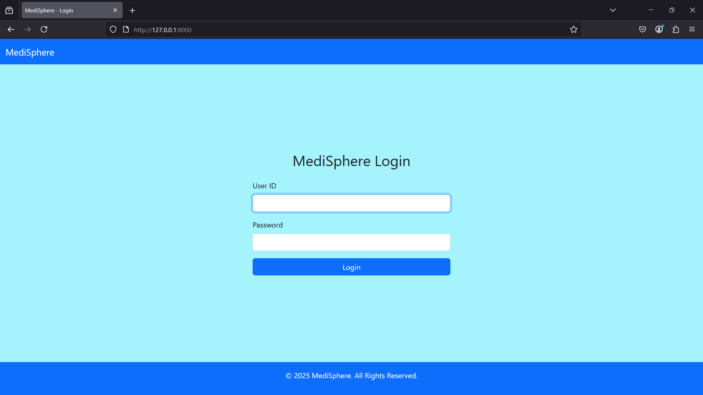

# 🏥 MediSphere - Hospital Management System

MediSphere is a full-featured **Hospital Management System** built using **Django**, **MySQL**, and **HTML/CSS**. It offers user-friendly interfaces for doctors, patients, and hospital staff to manage appointments, records, and operations efficiently.

---

## 🚀 Features

- Patient registration and login
- Doctor dashboard with appointment scheduling
- Admin control for managing doctors, patients, and staff
- Secure user authentication (custom login system)
- Medicine billing and invoice generation
- Responsive UI using Bootstrap templates

---

## 🛠️ Tech Stack

| Layer          | Technology                           |
|----------------|----------------------------------------|
| Backend        | Django (Python)                        |
| Frontend       | HTML, CSS, Bootstrap (via templates)   |
| Database       | MySQL (default) or SQLite (for development) |
| Version Control| Git & GitHub                          |

---

## ⚙️ Getting Started

Follow these steps to run the project locally:

### 1. Clone the repository

```bash
git clone https://github.com/Munavir-Ali/MediSphere.git
cd MediSphere
```

### 2. Create a virtual environment

```bash
python -m venv venv
venv\Scripts\activate   # On Windows
```

### 3. Install dependencies

```bash
pip install -r requirements.txt
```

### 4. Configure the database

- Default: Uses `db.sqlite3` (no setup needed)
- To use MySQL: Update the database section in `hms_project/settings.py` with your credentials

### 5. Run migrations and create superuser

```bash
python manage.py makemigrations
python manage.py migrate
python manage.py createsuperuser
```

### 6. Run the development server

```bash
python manage.py runserver
```

---

## 📁 Project Structure

```
MediSphere/
│
├── hms/                  # Main Django app (views, models, forms, urls, etc.)
│   ├── admin.py
│   ├── models.py
│   ├── views.py
│   └── ...
│
├── hms_project/          # Project settings and URL configuration
│   ├── settings.py
│   ├── urls.py
│   └── ...
│
├── templates/            # All frontend HTML templates
│   ├── registration/
│   ├── dashboard/
│   └── ...
│
├── sample_docs/          # Sample files like generated invoices (PDFs)
│   ├── invoice_1.pdf
│   └── invoice_2.pdf
│
├── screenshots/          # Optional: screenshots for documentation/demo
│   ├── login.png
│   ├── dashboard.png
│   └── invoice_sample.png
│
├── requirements.txt      # Python dependencies
├── manage.py             # Django's CLI tool
├── .gitignore            # Git ignore rules
├── README.md             # Project documentation
└── db.sqlite3            # Dev database (ignored in version control)
```

---

## 📸 Screenshots

### 🔐 Login Page


### 🩺 Doctor Dashboard


### 🧾 Invoice Sample


---

## 📎 Sample Invoices

- [🧾 Invoice 1](sample_docs/invoice_1.pdf)
- [🧾 Invoice 2](sample_docs/invoice_2.pdf)


---

---

## 📄 License

This project is licensed under the [GNU General Public License v3.0](https://www.gnu.org/licenses/gpl-3.0.en.html).

---

## 👤 Author

**Munavir Ali**  
GitHub: [@Munavir-Ali](https://github.com/Munavir-Ali)

---

## 🤝 Contributing

Pull requests are welcome! For major changes, please open an issue first to discuss what you'd like to change.
